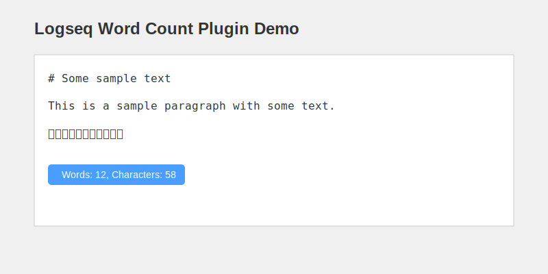

# Logseq Word Count Plugin

一个简单而实用的 Logseq 插件，用于统计当前页面或选中文本的字数。支持中英文混合统计。



## 功能特点

- 实时字数统计
- 支持中英文混合统计
- 支持整页统计和选中文本统计
- 简洁的用户界面
- 轻量级设计，不影响编辑器性能

## 使用方法

1. 在 Logseq 中启用插件后，你可以：
   - 使用命令 `/word count` 统计当前页面字数
   - 选中文本后，右键菜单中选择"统计字数"
   - 在工具栏中点击字数统计图标

2. 统计结果将显示：
   - 总字数（包括中英文）
   - 英文单词数
   - 中文字符数
   - 总字符数

## 安装方法

### 从 Marketplace 安装

1. 在 Logseq 中打开插件市场
2. 搜索 "Word Count"
3. 点击安装

### 手动安装

1. 下载最新的发布版本
2. 解压下载的文件
3. 点击 Logseq 中的 "加载解压的插件"
4. 选择解压后的文件夹

## 开发

```bash
# 安装依赖
npm install

# 开发模式
npm run dev

# 构建插件
npm run build
```

## 许可证

本项目基于 MIT 许可证开源。
